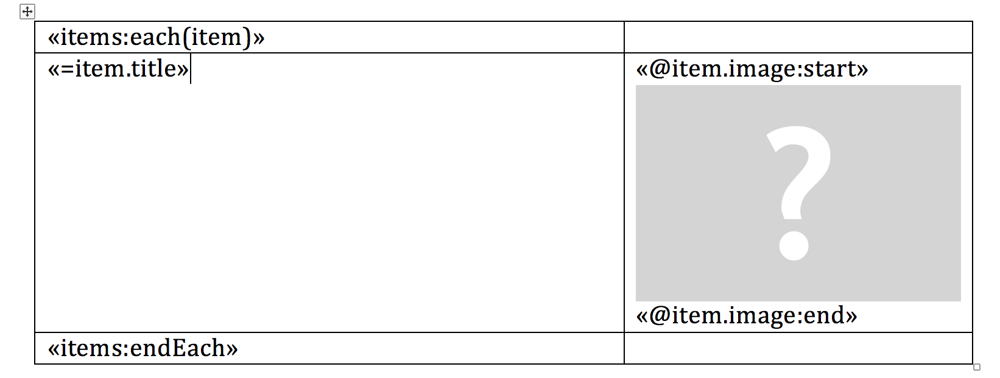

# Sablon

[](http://badge.fury.io/rb/sablon)
[](https://github.com/senny/sablon/actions)

Is a document template processor for Word `docx` files. It leverages Word's
built-in formatting and layouting capabilities to make template creation easy
and efficient.


#### Table of Contents
* [Installation](#installation)
* [Usage](#usage)
   * [Writing Templates](#writing-templates)
      * [Content Insertion](#content-insertion)
         * [WordProcessingML](#wordprocessingml)
         * [HTML](#html)
         * [Images (Beta)](#images-beta)
      * [Conditionals](#conditionals)
      * [Loops](#loops)
      * [Nesting](#nesting)
      * [Comments](#comments)
   * [Configuration (Beta)](#configuration-beta)
      * [Customizing HTML Tag Conversion](#customizing-html-tag-conversion)
      * [Customizing CSS Style Conversion](#customizing-css-style-conversion)
   * [Executable](#executable)
   * [Examples](#examples)
      * [Using a Ruby script](#using-a-ruby-script)
      * [Using the sablon executable](#using-the-sablon-executable)
* [Contributing](#contributing)
* [Inspiration](#inspiration)


## Installation

Add this line to your application's Gemfile:

```ruby
gem 'sablon'
```


## Usage

```ruby
require "sablon"
template = Sablon.template(File.expand_path("~/Desktop/template.docx"))
context = {
  title: "Fabulous Document",
  technologies: ["Ruby", "HTML", "ODF"]
}
template.render_to_file File.expand_path("~/Desktop/output.docx"), context
```


### Writing Templates

Sablon templates are normal Word documents (`.docx`) sprinkled with MailMerge fields
to perform operations. The following section uses the notation `«=title»` to
refer to [Word MailMerge](http://en.wikipedia.org/wiki/Mail_merge) fields.

A detailed description about how to create a template can be found [here](misc/TEMPLATE.md)

#### Content Insertion

The most basic operation is to insert content. The contents of a context
variable can be inserted using a field like:

```
«=title»
```

It's also possible to call a method on a context object using:

```
«=post.title»
```

NOTE: The dot operator can also be used to perform a hash lookup.
This means that it's not possible to call methods on a hash instance.
Sablon will always try to make a lookup instead.

This works for chained method calls and nested hash lookup as well:

```
«=buyer.address.street»
```

##### WordProcessingML

Generally Sablon tries to reuse the formatting defined in the template. However,
there are situations where more fine grained control is needed. Imagine you need
to insert a body of text containing different formats. If you can't decide the
format ahead of processing time (in the template) you can insert
[WordProcessingML](http://en.wikipedia.org/wiki/Microsoft_Office_XML_formats)
directly.

It's enough to use a simply insertion operation in the template:

```
«=long_description»
```

To insert WordProcessingML prepare the context accordingly:

```ruby
word_processing_ml = <<-XML.gsub("\n", "")
<w:p>
<w:r w:rsidRPr="00B97C39">
<w:rPr>
<w:b />
</w:rPr>
<w:t>this is bold text</w:t>
</w:r>
</w:p>
XML

context = {
  long_description: Sablon.content(:word_ml, word_processing_ml)
}
template.render_to_file File.expand_path("~/Desktop/output.docx"), context
```
In the example above the entire paragraph will be replaced because all of the nodes being inserted aren't valid children of a paragraph (w:p) element. The example below shows inline insertion, where only runs are added and instead of replacing the entire paragraph only the merge field gets removed.

**Important:** All text must be wrapped in a run tag for valid inline insertion because WordML is still inserted directly into the document "as is" without any structure transformations other than run properties being merged.

```ruby
word_processing_ml = <<-XML.gsub("\n", "")
<w:r w:rsidRPr="00B97C39">
<w:rPr>
<w:b />
</w:rPr>
<w:t>this is bold text</w:t>
</w:r>
XML

context = {
  long_description: Sablon.content(:word_ml, word_processing_ml)
}
template.render_to_file File.expand_path("~/Desktop/output.docx"), context
```


##### HTML

Similar to WordProcessingML it's possible to use html as input while processing the template. You don't need to modify your templates, a simple insertion operation
is sufficient:

```
«=article»
```

To use HTML insertion prepare the context like so:

```ruby
html_body = <<-HTML.strip
<div>
    This text can contain <em>additional formatting</em> according to the
    <strong>HTML</strong> specification. As well as links to external
    <a href="https://github.com/senny/sablon">websites</a>, don't forget
    the "http/https" bit.
</div>

<p style="text-align: right; background-color: #FFFF00">
    Right aligned content with a yellow background color.
</p>

<div>
    <span style="color: #123456">Inline styles</span> are possible as well
</div>

<table style="border: 1px solid #0000FF;">
    <caption>Table's can also be created via HTML</caption>
    <tr>
        <td>Cell 1 only text</td>
        <td>
            <ul>
                <li>List in Table - 1</li>
                <li>List in Table - 2</li>
            </ul>
        </td>
    </tr>
    <tr>
        <td></td>
        <td>
            <table style="border: 1px solid #FF0000;">
                <tr><th>A</th><th>B</th></tr>
                <tr><td>C</td><td>D</td></tr>
            </table>
        </td>
    </tr>
</table>
HTML
context = {
  article: Sablon.content(:html, html_body) },
  # Or use html: prefix to make sablon parse the value as HTML.
  # Does the same as above.
  'html:article' => html_body
}
template.render_to_file File.expand_path("~/Desktop/output.docx"), context
```

There is no 1:1 conversion between HTML and Open Office XML however, a large
number of tags are very similar. HTML insertion is relatively complete
covering several key content structures such as paragraphs, tables and lists.
The snippet above showcases some of the capabilities present, for a comprehensive
example please see the html insertion test fixture [here](test/fixtures/html/html_test_content.html).
All html element conversions are defined in [configuration.rb](lib/sablon/configuration/configuration.rb)
with their matching AST classes defined in [ast.rb](lib/sablon/html/ast.rb).

Basic conversion of CSS inline styles into matching WordML properties is possible
using the `style=" ... "` attribute in the HTML markup. Not all CSS properties
are supported as only a small subset of CSS styles have a direct Open Office XML
equivalent. Styles are passed onto nested elements if the parent can't use them.
The currently supported styles are also defined in [configuration.rb](lib/sablon/configuration/configuration.rb). Toggle
properties that aren't directly supported can be added using the
`text-decoration: ` style attribute with the proper XML tag name as the
value (i.e. `text-decoration: dstrike` for `w:dstrike`). Simple single value properties that do not need a conversion can be added using the XML property name directly, omitting the `w:` prefix i.e.
(`highlight: cyan` for `w:highlight`).

Table, Paragraph and Run property references can be found at:
  * http://officeopenxml.com/WPparagraphProperties.php
  * http://officeopenxml.com/WPtextFormatting.php
  * http://officeopenxml.com/WPtableProperties.php

The full Open Office XML specification used to develop the HTML converter
can be found [here](https://www.ecma-international.org/publications/standards/Ecma-376.htm) (3rd Edition).


The example above shows an HTML insertion operation that will replace the entire paragraph. In the same fashion as WordML, inline HTML insertion is possible where only the merge field is replaced as long as only "inline" elements are used. "Inline" in this context does not necessarily mean the same thing as it does in CSS, in this case it means that once the HTML is converted to WordML only valid children of a paragraph (w:p) tag exist. As with WordML all plain text needs to be wrapped in a HTML tag. A simple `<span>..</span>` tag enclosing all other elements will suffice. See the example below:

```ruby
inline_html = <<-HTML.strip
    <span>This text can contain <em>additional formatting</em> according to the
    <strong>HTML</strong> specification. As well as links to external
    <a href="https://github.com/senny/sablon">websites</a>, don't forget
    the "http/https" bit.</span>
HTML
context = {
  article: Sablon.content(:html, inline_html) }
  # alternative method using special key format
  # 'html:article' => html_body
}
template.render_to_file File.expand_path("~/Desktop/output.docx"), context
```


##### Images (beta)

Images can be added to the document using a placeholder image wrapped in a
pair of merge fields set up as `«@figure:start»` and `«@figure:end»`. Where
in this case "figure" is the key of the context hash storing the image.

Images are wrapped in an instance of a `Sablon::Content` class in the same
fashion as HTML or WordML strings. An image may be initialized from multiple
sources such as file paths, URLs, or any object that exposes a `#read`
method that returns image data. When using a "readable object" if the object
doesn't have a `#filename` method then a `filename: '...'` option
needs to be added to the `Sablon.content` method call.

By default the inserted image takes the dimensions of the placeholder. The size of an image can also be defined dynamically by specifying width and height with unit (cm or in) in a properties hash like  `properties: {height: "2cm", width: "20cm"}`

```ruby
context = {
  figure: Sablon.content(:image, 'fixtures/images/c3po.jpg'),
  figure2: Sablon.content(:image, string_io_obj, filename: 'test.png'),
  figure3: Sablon.content(:image, string_io_obj, filename: 'test.png', properties: {height: '2cm', width: '2cm'})
  # alternative method using special key format for simple paths and URLs
  # 'image:figure' => 'fixtures/images/c3po.jpg'
}
```

Example:


Additional examples of usage can be found in
[images_template.docx](test/fixtures/images_template.docx) and
in [sablon_test.rb](test/sablon_test.rb).

#### Conditionals

Sablon can render parts of the template conditionally based on the value of a
context variable. Conditional fields are inserted around the content.

```
«technologies:if»
    ... arbitrary document markup ...
«technologies:endIf»
```

This will render the enclosed markup only if the expression is truthy.
Note that `nil`, `false` and `[]` are considered falsy. Everything else is
truthy.

For more complex conditionals you can use a predicate like so:

```
«body:if(present?)»
    ... arbitrary document markup ...
«body:endIf»
```

Finally, you can also mix in `elsif` and `else` clauses as well.

```
«body:if(present?)»
    ... arbitrary document markup ...
«body:elsif(nil?)»
    ... arbitrary document markup ...
[additional elsif blocks...]
«body:else»
    ... arbitrary document markup ...
«body:endIf»
```

#### Loops

Loops repeat parts of the document.

```
«technologies:each(technology)»
    ... arbitrary document markup ...
    ... use `technology` to refer to the current item ...
«technologies:endEach»
```

Loops can be used to repeat table rows or list enumerations. The fields need to
be placed in within table cells or enumeration items enclosing the rows or items
to repeat. Have a look at the
[example template](test/fixtures/cv_template.docx) for more details.


#### Nesting

It is possible to nest loops and conditionals.

#### Comments

Sometimes it's necessary to include markup in the template that should not be
visible in the rendered output. For example when defining sample numbering
styles for HTML insertion.

```
«comment»
    ... arbitrary document markup ...
«endComment»
```

### Configuration (Beta)

The Sablon::Configuration singleton is a new feature that allows the end user to customize HTML parsing to their needs without needing to fork and edit the source code of the gem. This API is still in a beta state and may be subject to change as future needs are identified beyond HTML conversion.

The example below show how to expose the configuration instance:
```ruby
Sablon.configure do |config|
  # manipulate config object
end
```

The default set of registered HTML tags and CSS property conversions are defined in [configuration.rb](lib/sablon/configuration/configuration.rb).

#### Customizing HTML Tag Conversion

Any HTML tag can be added using the configuration object even if it needs a custom AST class to handle conversion logic. Simple inline tags that only modify the style of text (i.e. the already supported `<b>` tag) can be added without an AST class as shown below:
```ruby
Sablon.configure do |config|
  config.register_html_tag(:bgcyan, :inline, properties: { highlight: 'cyan' })
end
```
The above tag simply adds a background color to text using the `<w:highlight w:val="cyan" />` property.


More complex business logic can be supported by adding a new class under the `Sablon::HTMLConverter` namespace. The new class will likely subclass `Sablon::HTMLConverter::Node` or `Sablon::HTMLConverter::Collection` depending on the needed behavior. The current AST classes serve as additional examples and can be found in [ast.rb](/lib/sablon/html/ast.rb). When registering a new HTML tag that uses a custom AST class the class must be passed in either by name using a lowercased and underscored symbol or the class object itself.

The block below shows how to register a new HTML tag that adds the following AST class: `Sablon::HTMLConverter::InstrText`.
```ruby
module Sablon
  class HTMLConverter
    class InstrText < Node
      # implementation details ...
    end
  end
end
# register tag
Sablon.configure do |config|
  config.register_html_tag(:bgcyan, :inline, ast_class: :instr_text)
end
```

Existing tags can be overwritten using the `config.register_html_tag` method or removed entirely using `config.remove_html_tag`.
```ruby
# remove tag
Sablon.configure do |config|
  # remove support for the span tag
  config.remove_html_tag(:span)
end
```


#### Customizing CSS Style Conversion

The conversion of CSS stored in an element's `style="..."` attribute can be customized using the configuration object as well. Adding a new style conversion or overriding an existing one is done using the `config.register_style_converter` method. It accepts three arguments the name of the AST node (as a lowercased and underscored symbol) the style applies to, the name of the CSS property (needs to be a string in most cases) and a lambda that accepts a single argument, the property value. The example below shows how to add a new style that sets the `<w:highlight />` property.
```ruby
# add style conversion
Sablon.configure do |config|
  # register new conversion for the Sablon::HTMLConverter::Run AST class.
  converter = lambda { |v| return 'highlight', v }
  config.register_style_converter(:run, 'custom-highlight', converter)
end
```

Existing conversions can be overwritten using the `config.register_style_converter` method or removed entirely using `config.remove_style_converter`.
```ruby
# remove tag
Sablon.configure do |config|
  # remove support for conversion of font-size for the Run AST class
  config.remove_style_converter(:run, 'font-size')
end
```

### Executable

The `sablon` executable can be used to process templates on the command-line.
The usage is as follows:

```
cat <context path>.json | sablon <template path> <output path>
```

If no `<output path>` is given, the document will be printed to stdout.


Have a look at [this test](test/executable_test.rb) for examples.

### Examples

#### Using a Ruby script

There is a [sample template](test/fixtures/cv_template.docx) in the
repository, which illustrates the functionality of sablon:

<p align="center">
  
</p>

Processing this template with some sample data yields the following
[output document](test/fixtures/cv_sample.docx).
For more details, check out this [test case](test/sablon_test.rb).

<p align="center">
  
</p>

#### Using the sablon executable

The [executable test](test/executable_test.rb) showcases the `sablon`
executable.

The [template](test/fixtures/recipe_template.docx)

<p align="center">
  
</p>

is rendered using a [json context](test/fixtures/recipe_context.json) to provide
the data. Following is the resulting [output](test/fixtures/recipe_sample.docx):

<p align="center">
  
</p>

## Contributing

1. Fork it ( https://github.com/senny/sablon/fork )
2. Create your feature branch (`git checkout -b my-new-feature`)
3. Commit your changes (`git commit -am 'Add some feature'`)
4. Push to the branch (`git push origin my-new-feature`)
5. Create a new Pull Request


## Inspiration

These projects address a similar goal and inspired the work on Sablon:

* [ruby-docx-templater](https://github.com/jawspeak/ruby-docx-templater)
* [docx_mailmerge](https://github.com/annaswims/docx_mailmerge)
